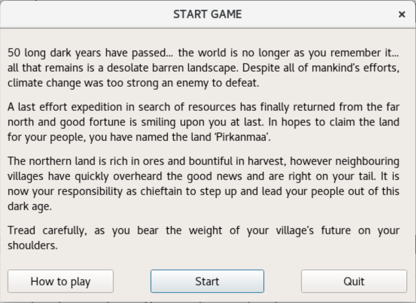
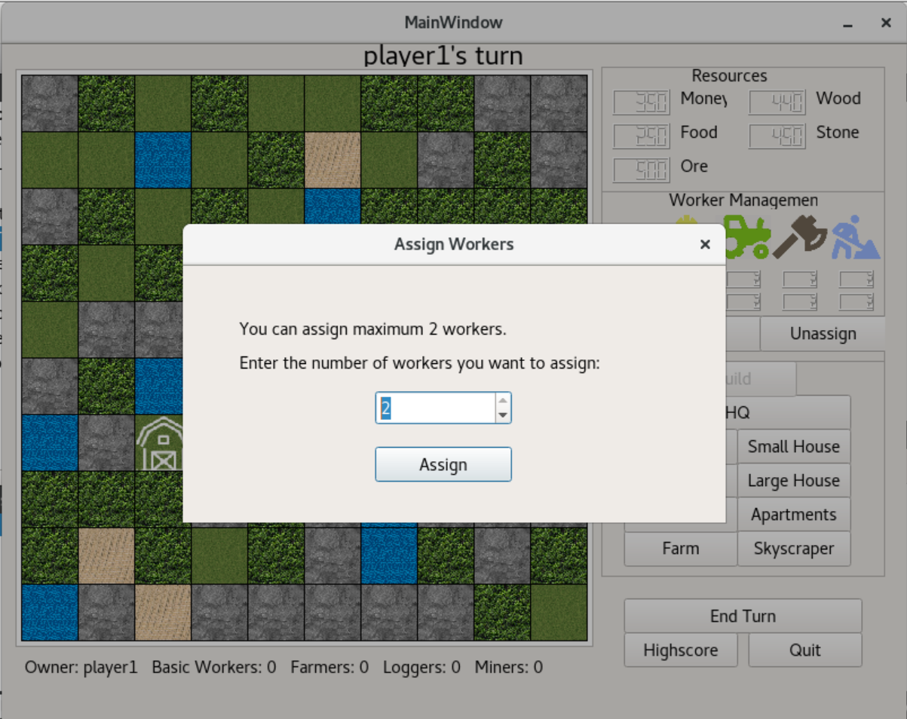

# Colonizing Pirkanmaa Game

## Description

This project is based on the idea of an existing board game - working title Colonizing Pirkanmaa. The aim of it is to
build the largest community in the initially uninhabited area of Pirkanmaa.

**Programming language** C++ and Qt

## How to install

STEP 1: Install [Qt](https://www.qt.io/)

STEP 2: Clone the repository
```
git clone https://github.com/hoanhle/Colonization-Game
```
STEP 3: Build project by Qt and run the game and unittest in Qt

## Game manual and instructions

### Start

Below is the start menu of the game with the depiction of the game world.

<p align="center">
  
</p>

### Game rule

The user first need to choose the number of players in the game (from 2 to 4 players).

<p align="center">
  
</p>
In the beginning, each player will have 500 resources of each type (food, money, ore, wood, stone). This money can be used to
buy and build buildings on the map, each of which have a respective build-cost and production benefits.

Each turn, player can do those following actions:

##### BUILD BUILDINGS TO GENERATE RESOURCES AND CLAIM THE OWNERSHIP OF THE LAND

<p align="center">
  
</p>

##### ASSIGN WORKERS TO HIS/HER LAND TO INCREASE THE EFFICIENCY PRODUCTION

<p align="center">
  
</p>

##### FREE WORKERS FROM HIS/HER LAND

<p align="center" style="width: 75%; height: 75%">
  
</p>

The game ends when a player can get 5000 resources in total and 50 people in total. His/her village becomes the largest in Pirkanmaa and they claim the ownership of the whole magical land!

One can read more detailed rules in [here](Documentation/rules.txt)

#### Extra features

* After a player has won the game, the score will be saved in score database. After that, when players click on the highscore button in the game, it will show the best 5 scores of all time.

<p align="center">
  
</p>

* Each building and worker brings different effect to the user. Moreover, the user can only acquire more people in his/her village if they build housing-type buildings.
* Players can choose to play again or end the game after a player has won


### Software documentation

One can further read more information about the project [here](Documentation/Documentation.pdf).
Doxygen generated documentation can be found in here [staff](Documentation/Course_Doxy-documentation) and [student](Documentation/Student_Doxygen-documentation).

### Support

Further support and information can be provided through this email address: <i>hoanh.le@tuni.fi</i>

### Authors and acknowledgement

Tampere Universities | Science and Engineering | ICT/Maths/Machine Learning
- Hoanh Le
- Ben Kavanagh
